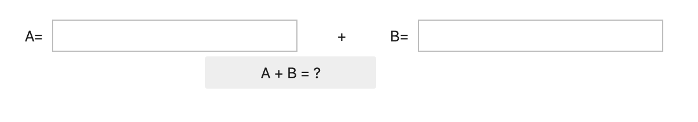
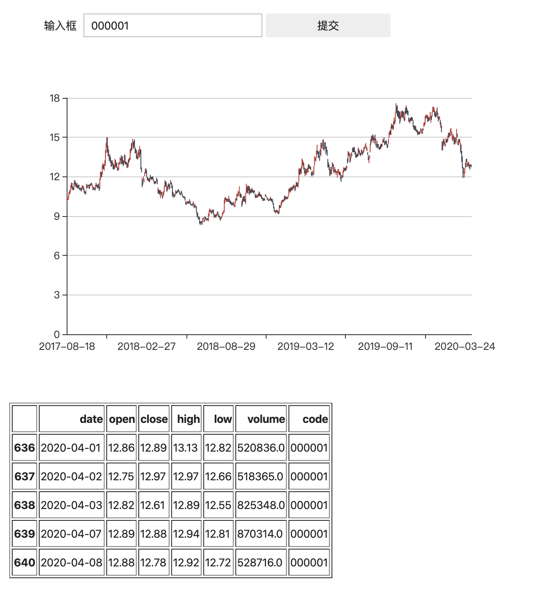

# 将Jupyter Notebook变成Web APP：Voila

基于python的jupyter notebook是数据科学常用的工具，不过也会有时候需要我们构建一些小工具自用，甚至让别人去使用，那么怎么最快的构建这样的应用，voila就提供了一种这种可能性。

注意voila的拼写，如果写成viola就是另一个包了。

安装[voila](https://voila.readthedocs.io/en/stable/contribute.html#running-the-examples)很简单`pip install voila`就可以，使用更简单，只要运行`voila jupyter_notebook_name.ipynb`就可以了，其实最重要的是构建notebok应用，这里需要用到ipywidgets（jupyter原名ipython）

## 第一个例子，a+b=？


```python
import ipywidgets as widgets
```

两个文本框


```python
input_text = widgets.Text(description='A=')
input_text2 = widgets.Text(description='B=')
```

一个label作为加号，向右偏移30px，也就是距离左侧30px


```python
plus_text = widgets.Label(value='+', layout=widgets.Layout(left='30px'))
```

提交按钮


```python
submit_button = widgets.Button(
    description='A + B = ?',
    layout=widgets.Layout(left='220px'))
```

显示结果的HTML组件


```python
html = widgets.HTML(value='')
```

设立一个事件响应函数submit，并把按钮的on_click事件绑定到这个函数上


```python
def submit(*ignore):
    a = input_text.value
    b = input_text2.value
    html.value = f'<b>{a + b}</b>'
    
submit_button.on_click(submit)
```

最后显示所有这些控件，下面的VBox和HBox就分别是竖向排列组件和横向排列组件，可以任何组合


```python
widgets.VBox([
    widgets.HBox([
        input_text,
        plus_text,
        input_text2
    ]),
    submit_button,
    html
])
```

我们可以先在jupyter notebook中预览结果，然后运行`voila xxx.ipynb`就可以运行了




## 第二个例子，输入股票代码显示k线图


```python
import re
import base64
import tushare as ts
import ipywidgets as widgets
import pyecharts.options as opts
from pyecharts.charts import Candlestick
```

这里我们用[tushare](https://pypi.org/project/tushare/)获取股票代码，
然后用[pyecharts](https://github.com/pyecharts/pyecharts)生成一个k线的html，
并在jupyter中显示


```python
def get_stock_plot_html(code):
    df = ts.get_k_data(code)
    x_data = [str(x) for x in df['date']]
    y_data = [
        [row['open'], row['close'], row['low'], row['high']]
        for _, row in df.iterrows()
    ]
    c = (
        Candlestick(init_opts=opts.InitOpts(width="600px", height="400px"))
        .add_xaxis(xaxis_data=x_data)
        .add_yaxis(series_name="", y_axis=y_data)
        .set_series_opts()
        .set_global_opts(
            yaxis_opts=opts.AxisOpts(
                splitline_opts=opts.SplitLineOpts(
                    is_show=True, linestyle_opts=opts.LineStyleOpts(width=1)
                )
            )
        )
    )
    out = c.render()
    with open(out) as fp:
        return df, fp.read()
```


```python
input_text = widgets.Text(description='输入框')
submit_button = widgets.Button(description='提交')
html = widgets.HTML(value='')

def submit(*ignore):
    code = input_text.value
    if re.match(r'^\d{6}$', code):
        # 这里我们把pyecharts生成的html转换为base64编码嵌入到结果
        df, html_src = get_stock_plot_html(code)
        html_src_b64 = base64.b64encode(html_src.encode('utf-8')).decode('utf-8')
        html.value = (
            f'<iframe src="data:text/html;base64,{html_src_b64}" '
            ' frameborder="0" style="width: 620px; height: 420px;"></iframe>'
            '<br />' + df.tail().to_html()
        )
    else:
        html.value = f'错误的代码"{code}"，不是6个数字'
    
submit_button.on_click(submit)

widgets.VBox([
    widgets.HBox([input_text, submit_button]),
    html
])
```

