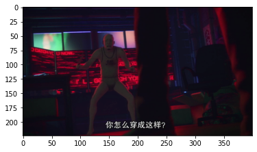
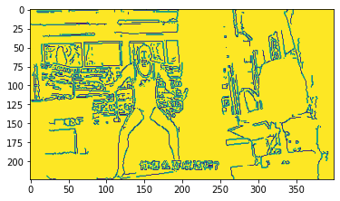
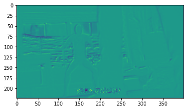
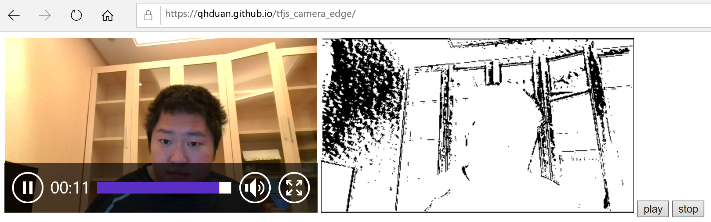

# 算法实现？一个并不严肃的手段，用机器学习模拟一个opencv的边缘识别算法

## 开篇先说

- 本文是把opencv里面的边缘检测算法，训练为TensorFlow的一个模型，并在浏览器的TensorFlowJS中运行这个模型，尝试这整个过程；
- 这个并不是一个严肃的方法，不过它的核心和机器学习一样，是普世的，我并不想说这 总 是一个合理的方法；
- 实现一个目标用什么方法、什么算法， 总 是有很多种方法的，从某种意义上来说，本文的方法在一些特殊情况也是可以应用的；

所有项目代码： [https://github.com/qhduan/tfjs_camera_edge](https://github.com/qhduan/tfjs_camera_edge)

## 按照机器学习的角度收集数据

### 首先随便找到一个视频，将它转换成图片

通过视频转换图片是快速收集图片的一个方法，这里用ffmpeg把一个视频转换成一堆图片，按照每秒一张的方式输出出来。

以下这条命令是把`input.mp4`这个文件，以每秒一帧`fps=1`，即每秒一个图片的形式，以400x225的大小，转换到`imgs`目录里面去：

```bash
$ ffmpeg -i 'input.mp4' -vf fps=1,scale=400:225 'imgs/out%05d.png'
```

### 把图片进行灰度处理，输出边缘检测后的图片

```python

import os
from pathlib import Path
import cv2
import math
import numpy as np
from tqdm import tqdm
from joblib import Parallel, delayed


# 这个函数完成具体的边缘检测，并且把黑白进行转换，即255转换为0，0转换为255
def get_image(gray, a, b):
    return 255 - cv2.Canny(gray, a, b)

def get_gray(fpath):
    # 读取图片
    img = cv2.imread(fpath)
    height, width = img.shape[:2]
    height, width = 224, 400
    # 转换大小
    img = cv2.resize(img, (width, height))
    img = cv2.cvtColor(img, cv2.COLOR_BGR2RGBA)
    # 转换成灰度图片（黑白）
    gray = cv2.cvtColor(img, cv2.COLOR_RGB2GRAY)
    return gray


imgs_root = Path(f'imgs')
# a, b是opencv边缘检测算法的参数，这里随便选取两个看上去还不错的
a, b = 10, 40
# 输出目录
os.makedirs(f'bin_imgs', exist_ok=True)


def convert(inpath, outpath):
    img = get_image(get_gray(inpath), 10, 40)
    cv2.imwrite(outpath, img)

# 从目录收集要转换的图片，构成参数
params = []
for dirname, _, filenames in os.walk(imgs_root):
    filenames = [x for x in filenames if x.endswith('.png')]
    for f in tqdm(filenames):
        inpath = str(imgs_root / f)
        outpath = f'bin_imgs/{f}'
        params.append((inpath, outpath))

# 用joblib实现多进程转换，快一点
_ = Parallel(n_jobs=-1, verbose=0)(delayed(convert)(a, b) for a, b in tqdm(params))
```

输入图片和预测图片的预览：





## 训练

经过上面的步骤，我们已经有了一些输入和输出能用来训练机器学习模型。

输入数据是一堆原始图片，输出数据是一堆经过边缘检测后的图片。

### 模型

模型部分这里用了一个特别简单的图像模型，没经过微调，实际上效果并不是最好的，那为什么用效果不好呢？因为这个模型参数只有817个，在浏览器里面运行也可以比较好的满帧运行。

```python
model = tf.keras.Sequential([
    tf.keras.layers.InputLayer(input_shape=(IMG_HEIGHT, IMG_WIDTH, 3)),
    tf.keras.layers.Conv2D(8, 3, padding='same', activation='relu'),
    tf.keras.layers.Conv2D(8, 3, padding='same', activation='relu'),
    tf.keras.layers.Conv2D(1, 1, padding='same'),
])


model.summary()

"""
Model: "sequential_23"
_________________________________________________________________
Layer (type)                 Output Shape              Param #   
=================================================================
conv2d_134 (Conv2D)          (None, 224, 400, 8)       224       
_________________________________________________________________
conv2d_135 (Conv2D)          (None, 224, 400, 8)       584       
_________________________________________________________________
conv2d_136 (Conv2D)          (None, 224, 400, 1)       9         
=================================================================
Total params: 817
Trainable params: 817
Non-trainable params: 0
_________________________________________________________________
"""

```

### 训练的其他部分

```python
from pathlib import Path
import tensorflow as tf
import numpy as np

IMG_HEIGHT, IMG_WIDTH = 224, 400


def decode_img(img):
    # convert the compressed string to a 3D uint8 tensor
    img = tf.image.decode_png(img, channels=3)
    # Use `convert_image_dtype` to convert to floats in the [0,1] range.
    img = tf.image.convert_image_dtype(img, tf.float32)
    # resize the image to the desired size.
    # return tf.image.resize(img, [IMG_HEIGHT, IMG_WIDTH])
    img = tf.image.resize(img, [IMG_HEIGHT, IMG_WIDTH])
    img = img[:-1,:,:]
    return img


def process_path(file_path):
    img = tf.io.read_file(file_path)
    img = decode_img(img)
    
    label_path = tf.strings.regex_replace(file_path, 'imgs', 'bin_imgs')
    label = tf.io.read_file(label_path)
    label = decode_img(label)
    label = tf.cast(label > 0.5, tf.float32)[:, :, :1]
    return img, label


data_dir = Path(f'imgs')
input_ds = tf.data.Dataset.list_files(str(data_dir / '*.png'))
input_ds = input_ds.map(process_path)

train_ds = input_ds.shuffle(buffer_size=100).repeat().batch(32)

model.compile(
    loss=tf.keras.losses.MeanSquaredError(),
    optimizer=tf.keras.optimizers.Adam(5e-5),
    metrics=['acc']
)

model.fit(train_ds, steps_per_epoch=50, epochs=50)


model.save(f'./model_export')

```

上面代码的最后，我们把模型转换到了model_export文件夹里面

训练好后输出图片的预览




可以看出来模型效果并不算好~~主要是因为我们把模型参数限制的太小了

## 运行

### 转换模型到TensorFlow JS的格式

需要安装python包tensorflowjs

然后运行：

```bash
tensorflowjs_converter ./model_export ./modeljs
```

最终得到浏览器可以读取的model.json文件

### 让我们在TensorFlow JS里面读取模型并运行模型

最终完整成品的预览：



```html
<html>

<head>
    <script src="https://cdn.jsdelivr.net/npm/@tensorflow/tfjs@2.0.0/dist/tf.min.js"></script>

</head>

<body>

    <video id="video" controls="controls" style="height: 224px; width: 400px; opacity: 1;">
        <!-- <source type="video/mp4" src="3.mp4" id="mp4"></source> -->
    </video>
    <canvas id="render" style="height: 224px; width: 400px; opacity: 1;"></canvas>
    <button id='play'>play</button>
    <button id='stop'>stop</button>

    <script>

        const height = 224
        const width = 400
        let isStop = false

        let model = null

        // 读取模型
        async function loadModel() {
            model = await tf.loadGraphModel('jsmodel/model.json')
        }
        loadModel()

        const video = document.querySelector("video")
        const canvasRender = document.querySelector("#render")
        const contextRender = canvasRender.getContext('2d')

        // 获取摄像头权限
        if (navigator.mediaDevices.getUserMedia) {
            navigator.mediaDevices.getUserMedia({ video: true })
            .then(function (stream) {
                video.srcObject = stream;
            })
            .catch(function (err0r) {
                console.log("Something went wrong!");
            });
        }

        // 从摄像头里面获取一个图片
        function getImage() {
            let img = tf.image.resizeBilinear(tf.expandDims(tf.browser.fromPixels(document.querySelector('video')), 0), [height, width])
            return tf.div(img, 255.0)
        }

        // 主循环
        async function run() {
            if (!model) {
                return window.requestAnimationFrame(run)
            }
            // 获取图片
            const input = getImage()
            // 预测图片
            let out = model.execute(input)
            // 图片归一
            out = tf.clipByValue(out, 0.0, 1.0)
            // 设置0.75的阈值
            out = tf.cast(tf.greater(out, 0.75), 'float32')
            // 去掉多余的张量维度
            out = out.squeeze()
            // 绘制图片
            tf.browser.toPixels(out, canvasRender)
            if (!isStop) {
                setTimeout(run, 50)
            }
        }

        document.querySelector('#play').addEventListener('click', () => {
            video.play()
            isStop = false
            run()
        })

        document.querySelector('#stop').addEventListener('click', () => {
            isStop = true
            video.pause()
        })

    </script>
</body>

</html>
```